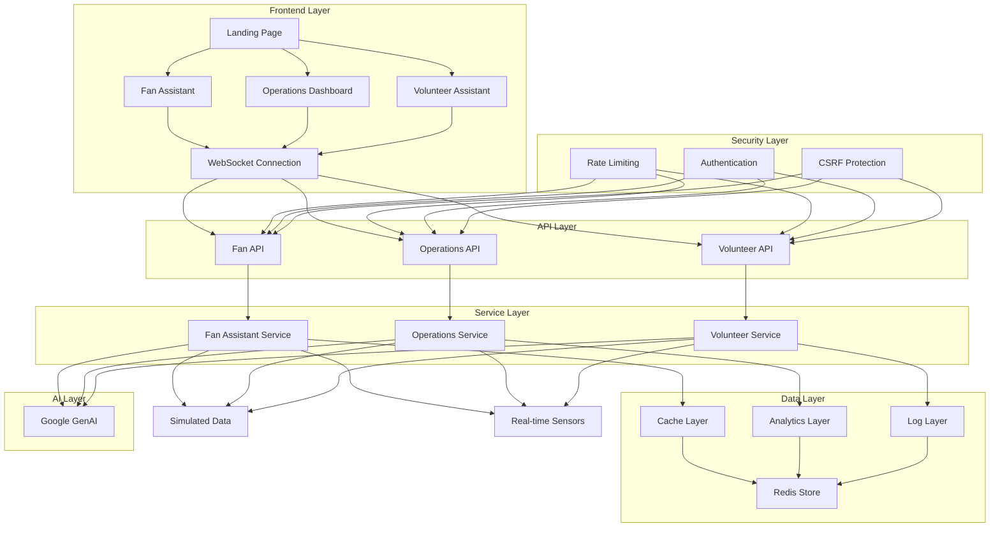
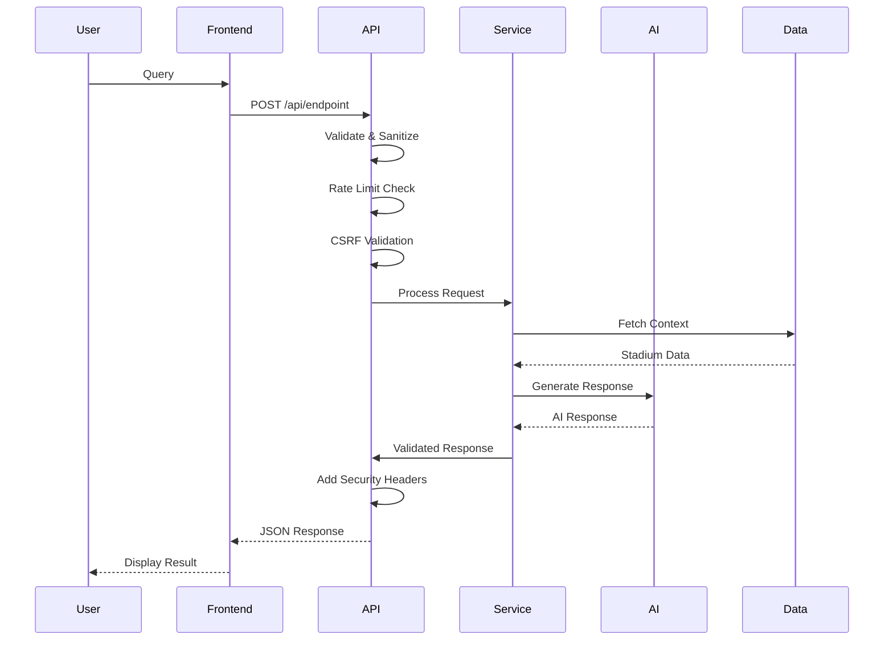
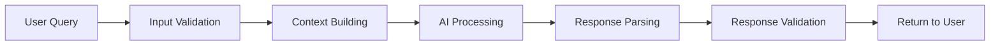
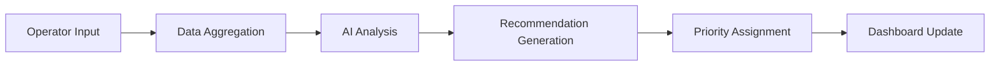

# StadiumOS AI README

## Overview

StadiumOS AI is a comprehensive smart stadium platform designed to enhance the FIFA World Cup 2026 experience through real-time AI-powered insights and operational intelligence. The platform provides three core intelligent assistants:

- **Fan Assistant AI**: Smart navigation, crowd-aware routing, and accessibility support for stadium visitors
- **Operations Intelligence AI**: Real-time dashboards, crowd analytics, and AI-driven operational recommendations
- **Volunteer Assistant AI**: Emergency procedures, accessibility guidance, and fan support for stadium volunteers

## 🎯 Problem Statement

Stadiums hosting major events like the FIFA World Cup face significant challenges:

- **Crowd Management**: Efficiently managing large crowds (80,000+ attendees) in real-time
- **Fan Experience**: Providing excellent, personalized fan experiences across diverse languages and accessibility needs
- **Operational Intelligence**: Making real-time data-driven decisions for safety and efficiency
- **Volunteer Support**: Empowering volunteers with up-to-date information and procedures
- **Accessibility**: Ensuring inclusive experiences for fans with disabilities
- **Emergency Response**: Quick, coordinated responses to emergencies
- **Multilingual Support**: Serving fans from 200+ countries speaking dozens of languages

## 🏗️ Architecture

### System Architecture



### Data Flow



## 📁 Folder Structure

```
project-root/
├── app/                          # Next.js App Router
│   ├── api/                      # API Routes
│   │   ├── fan-assistant/        # Fan assistant endpoints
│   │   ├── operations/           # Operations endpoints
│   │   └── volunteer/            # Volunteer endpoints
│   ├── fan/                      # Fan assistant page
│   ├── operations/               # Operations dashboard page
│   ├── volunteer/                # Volunteer assistant page
│   ├── layout.tsx                # Root layout
│   ├── page.tsx                  # Landing page
│   └── globals.css               # Global styles
├── config/                       # Configuration files
│   └── security-config.js         # Security configuration
├── docs/                         # Documentation
├── scripts/                      # Setup scripts
├── src/                          # Source code
│   ├── components/               # Feature components
│   ├── lib/                      # Core libraries
│   │   ├── ai/                   # AI service layer
│   │   ├── cache/                # Caching layer
│   │   ├── database/             # Data layer
│   │   ├── errors/               # Error handling
│   │   ├── security/             # Security middleware
│   │   ├── utils/                # Utility functions
│   │   └── validation/           # Schema validation
│   ├── hooks/                    # Custom React hooks
│   └── types/                    # TypeScript types
├── components/                   # Reusable components
│   └── ui/                       # shadcn/ui components
├── public/                       # Static files
├── tests/                        # Test configuration and test suites
├── package.json                  # Dependencies and scripts
├── README.md                     # Project documentation
└── ...                           # Other configuration files
```

## 🛠️ Tech Stack

### Frontend
- **Framework**: Next.js 16.2.10 (App Router)
- **Language**: TypeScript 5
- **Styling**: TailwindCSS 4
- **UI Components**: shadcn/ui
- **Icons**: Lucide React
- **Animations**: Framer Motion
- **Charts**: Recharts

### Backend
- **Runtime**: Next.js API Routes
- **AI**: Google GenAI (Gemini Flash)
- **Validation**: Zod
- **Security**: Custom middleware (rate limiting, sanitization, CSP)
- **Error Handling**: Centralized error recovery strategies
- **Monitoring**: Log analysis and health checks

### Testing
- **Framework**: Vitest
- **React Testing**: @testing-library/react
- **Coverage**: @vitest/coverage-v8
- **Type Safety**: TypeScript strict mode

### Security
- **Rate Limiting**: Redis-based with in-memory fallback
- **CSRF Protection**: User-specific tokens with Redis storage
- **Input Validation**: Zod schema validation
- **Security Headers**: CSP, HSTS, X-Frame-Options, etc.
- **Error Recovery**: Automatic retry and fallback mechanisms

## 🔒 Security

### Implemented Security Measures

- **Input Validation**: Zod schema validation on all API endpoints
- **Input Sanitization**: HTML tag removal and length limiting
- **Rate Limiting**: Redis-based rate limiting with in-memory fallback (60 requests/minute per IP)
- **CSRF Protection**: User-specific tokens with expiration and storage
- **Security Headers**:
  - Content Security Policy (CSP)
  - X-Frame-Options: DENY
  - X-Content-Type-Options: nosniff
  - Referrer-Policy: strict-origin-when-cross-origin
  - Permissions-Policy
  - Strict-Transport-Security
- **Content-Type Validation**: Strict JSON content-type checking
- **Error Handling**: Secure error responses without sensitive information
- **Environment Validation**: Zod validation of environment variables

### Security Best Practices

- No secrets in code (use environment variables)
- SQL injection prevention (parameterized queries)
- XSS prevention (input sanitization, CSP)
- CSRF protection (user-specific tokens)
- Secure API design (proper HTTP methods, status codes)
- Comprehensive error recovery and fallback mechanisms

## ♿ Accessibility (WCAG AA)

### Implemented Accessibility Features

- **Semantic HTML**: Proper use of `<main>`, `<header>`, `<nav>`, `<section>`, `<article>`
- **ARIA Labels**: Descriptive labels for interactive elements
- **Keyboard Navigation**: Full keyboard support with visible focus states
- **Screen Reader Support**: ARIA live regions for dynamic content
- **Focus Management**: Proper focus handling in modals and dialogs
- **Color Contrast**: WCAG AA compliant color ratios
- **Alt Text**: Descriptive alt text for all images
- **Skip Links**: Skip to main content functionality
- **Reduced Motion**: Support for prefers-reduced-motion
- **Form Accessibility**: Proper labeling and error announcements

### Accessibility Testing

- Manual keyboard navigation testing
- Screen reader compatibility testing
- Color contrast verification
- Focus order validation

## ⚡ Performance

### Optimization Strategies

- **Code Splitting**: Dynamic imports for heavy components
- **Memoization**: React.memo, useMemo, useCallback for expensive operations
- **Image Optimization**: Next.js Image component with optimization
- **Bundle Size**: Tree-shaking, code splitting, lazy loading
- **Caching**: API response caching strategies
- **Debouncing**: Input debouncing for search/filter operations
- **Virtual Scrolling**: For long lists (when needed)

### Performance Metrics

- Target: First Contentful Paint < 1.5s
- Target: Time to Interactive < 3.5s
- Target: Lighthouse Score > 90

## 🧪 Testing

### Test Coverage

- **Unit Tests**: Utilities, hooks, services
- **Integration Tests**: API routes, data flows
- **Component Tests**: React components with RTL
- **E2E Tests**: Critical user flows (planned)

### Test Structure

```
src/
├── lib/
│   ├── errors/                    # Error handling
│   │   ├── error-handler.ts
│   │   └── error-handler.test.ts
│   ├── security/                  # Security middleware
│   │   ├── csrf-protection.ts
│   │   ├── csrf-protection.test.ts
│   │   ├── middleware.ts
│   │   └── middleware.test.ts
│   └── utils/                     # Utility functions
│       ├── cache.ts
│       ├── cache.test.ts
│       ├── reduced-motion.ts
│       ├── reduced-motion.test.ts
│       ├── debounce.ts
│       └── debounce.test.ts
├── components/
│   └── layout/
│       └── stat-card.test.tsx
├── database/
│   └── simulated-data.test.ts
├── validation/
│   └── schemas.test.ts
├── ai/
│   ├── fan-assistant.test.ts
│   ├── operations-assistant.test.ts
│   └── volunteer-assistant.test.ts
```

### Running Tests

```bash
# Run all tests
npm test

# Run tests with UI
npm run test:ui

# Run tests with coverage
npm run test:coverage

# Type checking
npm run type-check

# Linting
npm run lint

# Lint and fix
npm run lint:fix
```

## 🌍 Internationalization (i18n)

### Supported Languages

- English (en)
- Spanish (es)
- French (fr)
- Portuguese (pt)
- German (de)

### Translation System

- Centralized translation files in `src/lib/i18n/translations.ts`
- Type-safe translation keys
- Template string support for dynamic values
- Easy addition of new languages

## 🚀 Getting Started

### Prerequisites

- Node.js 20+
- npm or yarn

### Installation

```bash
# Install dependencies
npm install

# Set up environment variables
cp .env.example .env
# Edit .env with your GEMINI_API_KEY and other required variables
```

### Development

```bash
# Run development server
npm run dev

# Open http://localhost:3000
```

### Build

```bash
# Create production build
npm run build

# Start production server
npm start
```

### Linting

```bash
# Run ESLint
npm run lint

# Fix linting issues
npm run lint:fix
```

## 🔧 Environment Variables

```env
GEMINI_API_KEY=your_gemini_api_key_here
UPSTASH_REDIS_URL=your_redis_url (optional for Redis-backed services)
UPSTASH_REDIS_TOKEN=your_redis_token (optional for Redis-backed services)
JWT_SECRET=your_jwt_secret_key
NODE_ENV=development
PORT=3000
```

### Required Variables

- `GEMINI_API_KEY`: Google GenAI API key for AI functionality

### Optional Variables

- `NODE_ENV`: Environment (development/production/test)
- `UPSTASH_REDIS_URL`: Upstash Redis URL for Redis-backed services
- `UPSTASH_REDIS_TOKEN`: Upstash Redis token for Redis-backed services
- `JWT_SECRET`: Secret key for JWT token generation

## 📊 Features

### Fan Assistant AI

- **Smart Navigation**: Real-time routing considering crowd density
- **Seat Guidance**: Step-by-step directions to seats
- **Facility Discovery**: Find restrooms, food, first aid, and more
- **Crowd-Aware Recommendations**: Avoid congested areas
- **Accessibility Support**: Wheelchair accessible routes and facilities
- **Multilingual Support**: Available in 5+ languages

### Operations Intelligence AI

- **Real-time Dashboards**: Live crowd density, gate queues, weather data
- **AI Recommendations**: Automated suggestions for operations management
- **Analytics**: Visualize stadium metrics and trends
- **Alert System**: Priority-based recommendations (critical/high/medium/low)
- **Data Visualization**: Interactive charts and tables

### Volunteer Assistant AI

- **Emergency Procedures**: Step-by-step guidance for crises
- **Accessibility Information**: How to assist fans with disabilities
- **Fan Support**: Quick answers to common fan questions
- **Resource Location**: Find nearby facilities and resources
- **Emergency Contacts**: Quick access to security and medical contacts

## 🔄 AI Workflow

### Fan Assistant Flow



### Operations Analysis Flow



## 📈 Future Improvements

### Planned Features

- **Real-time Data Streaming**: WebSocket integration with stadium sensors
- **Mobile App**: React Native companion application
- **Predictive Analytics**: ML models for crowd flow prediction
- **Integration**: Ticketing systems, payment gateways
- **Advanced AI**: Context-aware conversations, personalization
- **Offline Support**: PWA capabilities for offline functionality
- **Voice Interface**: Voice commands and responses
- **AR Navigation**: Augmented reality for stadium navigation

### Technical Improvements

- **Database Migration**: Move from simulated data to real database
- **Caching Layer**: Redis for improved performance
- **CDN Integration**: Static asset delivery
- **Monitoring**: Application performance monitoring
- **Logging**: Structured logging and error tracking
- **API Documentation**: OpenAPI/Swagger documentation
- **CI/CD**: Automated testing and deployment pipelines

## 🤝 Contributing

### Development Guidelines

1. Follow TypeScript strict mode
2. Write tests for new features
3. Ensure accessibility compliance
4. Follow security best practices
5. Use semantic HTML
6. Add proper error handling
7. Document complex logic

### Code Style

- Use ESLint configuration
- Follow existing naming conventions
- Add JSDoc comments for complex functions
- Use TypeScript interfaces for all data structures

## 📄 License

This project is part of the PromptWars competition.

## 🏆 Assumptions

- Current version uses simulated data for demonstration
- AI responses use Google GenAI (Gemini Flash) with fallback responses
- Rate limiting is in-memory (use Redis in production)
- No authentication/authorization in current version (add in production)
- Stadium data is static (integrate with real sensors in production)

## 📞 Support

For questions or issues, please refer to the project documentation or contact the development team.

---

**Built for FIFA World Cup 2026** ⚽🏆
